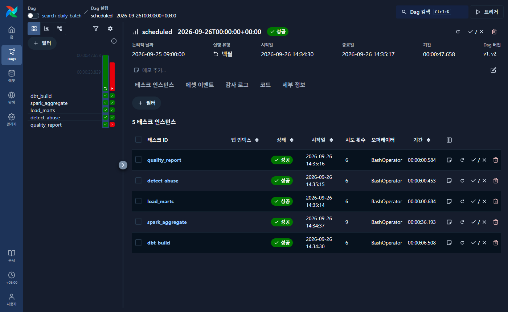

# delivery-event-pipeline

[](https://github.com/RaphaelAhn/delivery-event-pipeline/actions/workflows/ci.yml)

합성 **검색 로그**(검색어·클릭, 봇 트래픽 포함)와 배달 이벤트(주문·배차·배달)를
**Kafka로 수집 → 계약 검증 → ClickHouse 적재 → dbt로 정제·마트 생성**하고,
**Airflow가 날짜 단위로 매일 돌리는(백필 가능)** 로컬 데이터 파이프라인입니다.

설계 문서(이벤트 계약, 지표 정의, 운영 Runbook)는
[data-portfolio / delivery-data-platform](https://github.com/RaphaelAhn/data-portfolio/tree/main/projects/delivery-data-platform)에 있고,
이 저장소는 그 설계를 실제로 실행되는 코드로 구현합니다.

> 진행 중: 2주차 (Airflow 일별 배치까지 완료, 서버 배포·관측 예정). 아래 체크리스트 참고.

## 아키텍처

```
generator / search_generator ──► Kafka (orders / dispatch / delivery / search.events)
                 │
                 ▼
          Python consumer ── 계약 위반 ──► raw_dlq_events
                 │
                 ▼
     ClickHouse raw_*_events (들어온 그대로 보존)
                 │
                 ▼
     dbt staging (타입 정리, event_id 중복 제거)
                 │
                 ├──► fct_delivery_order   주문 1건 = 1행
                 │
 Spark (Docker) ─┴──► mart_search_session / _daily / _top_query
                      세션 1개 = 1행, 일별 지표, 인기 검색어
                             │
                             ▼
                      mart_session_abuse ──► mart_quality_report
                      어뷰징 판정·사유       날짜별 품질 점검 결과

Airflow DAG search_daily_batch (매일 00:00 UTC, 날짜 단위 백필 가능)
  dbt_build → spark_aggregate → load_marts → detect_abuse → quality_report
```

## 일부러 섞는 데이터 문제

실제 로그에서 흔한 문제를 generator가 비율만큼 섞고, 무엇을 섞었는지 `*.manifest.json`에 정답으로 남깁니다.
파이프라인이 이 문제를 제대로 처리하는지 정답과 비교해 검증합니다.

| 종류 | 내용 | 파이프라인에서 처리하는 곳 |
|---|---|---|
| duplicate | 같은 `event_id` 재전송 | dbt staging 중복 제거 |
| late | 10~120분 늦게 도착 | event_time 기준 집계, 재처리 |
| out_of_order | 부모 주문보다 먼저 도착 | 적재 시 orphan으로 버리지 않음 |
| invalid | 필수 필드 누락, 잘못된 값 | 컨슈머 검증 → DLQ |

## 실행

필요: Docker Desktop, Python 3.11+

```bash
python -m venv .venv
.venv\Scripts\activate          # macOS/Linux: source .venv/bin/activate
pip install -e ".[dev]"
cp .env.example .env

# 컨테이너 기동 + 토픽 생성
./scripts/up.ps1                # macOS/Linux: ./scripts/up.sh

# 이벤트 생성 → Kafka 발행
python -m pipeline.producer.generator --orders 1000          # 배달 이벤트
python -m pipeline.producer.publish

python -m pipeline.producer.search_generator --sessions 2000  # 검색 로그 (봇 5% 포함)
python -m pipeline.producer.publish --input data/search_events.jsonl
```

Kafka UI: http://localhost:8080

수집한 이벤트를 검사해 ClickHouse에 적재하고, dbt로 정제합니다.

```bash
python -m pipeline.consumer.run --from-beginning   # Kafka → 검사 → ClickHouse (불합격은 DLQ)

cd dbt
dbt deps
dbt build                                          # staging 중복 제거 → fct_delivery_order + 테스트
cd ..

# 검색 로그 집계 (Spark는 Docker로 실행 — 로컬에 Java 불필요)
./scripts/spark_submit.ps1                         # macOS/Linux: ./scripts/spark_submit.sh
python -m pipeline.marts.load_search_marts --input data/marts

# 어뷰징 탐지 (세션 마트를 읽어 점수를 매기고 판정 사유와 함께 저장)
python -m pipeline.detect.run_detection --threshold 0.5
```

Windows에서 dbt를 돌릴 때는 `PYTHONUTF8=1`을 설정하세요. 설정하지 않으면 한글 주석이 있는 파일을
시스템 인코딩(cp949)으로 읽으려다 실패합니다.

## Airflow 일별 배치와 백필

위 단계를 Airflow DAG `search_daily_batch` 하나가 날짜 단위로 순서대로 실행합니다.
LocalExecutor 로 돌고, dbt·PySpark 는 Airflow 와 별도 venv 에 설치된 이미지(`airflow/Dockerfile`)를 씁니다.

```bash
# 처리할 날짜의 검색 로그를 착지 폴더에 만든다 (백필 시연용: 9/25 하루치)
python -m pipeline.producer.search_generator --sessions 3000 --seed 925 \
    --start 2026-09-25 --output data/landing/search/batch-001.jsonl

docker compose --profile airflow up -d --build     # Airflow UI: http://localhost:8081

# 9/25 하루를 백필 (몇 번을 돌려도 결과는 한 벌)
docker exec dep-airflow-scheduler airflow backfill create --dag-id search_daily_batch \
    --from-date 2026-09-25 --to-date 2026-09-25 --reprocess-behavior completed
```



9/25 구간 실행(실행 유형 `백필`)의 화면입니다(시각은 KST 표시). 다섯 단계가 모두 성공했고, 시도 횟수 6은
같은 날짜를 여섯 번 다시 돌렸다는 뜻입니다. `spark_aggregate` 의 9회에는 첫 실행에서 출력 폴더 권한 문제로
재시도 3회 끝에 실패한 기록이 포함돼 있습니다. 왼쪽 빨간 칸은 데이터가 없는 날짜(9/10)를 일부러 돌려
품질 점검 실패 → 알림 기록을 확인한 실행입니다.

| 단계 | 하는 일 | 다시 돌려도 안전한 이유 |
|---|---|---|
| `dbt_build` | 배달 이벤트 staging → `fct_delivery_order` + dbt 테스트 | 모델을 매번 새로 만든다 |
| `spark_aggregate` | 착지 파일 전체에서 그날 것만 골라 세션·일별·인기 검색어 집계 | 출력 폴더 `dt=<날짜>` 를 덮어쓴다 |
| `load_marts` | 집계 결과를 ClickHouse 마트에 적재 | 그날 행을 지우고 넣는다 |
| `detect_abuse` | 그날 세션에 어뷰징 점수와 사유를 매김 | 그날 판정을 지우고 넣는다 |
| `quality_report` | 중복·누락·판정 누락·오탐 비율 점검 → JSON + `mart_quality_report` | 그날 점검 결과를 지우고 넣는다 |

- **날짜 규칙**: 9/26 00:00 UTC 실행이 9/25 구간을 처리합니다(`CronDataIntervalTimetable`, `ds` = 처리 날짜).
  세션은 시작한 날짜에 속하므로 자정을 넘긴 세션도 두 날짜로 쪼개지지 않습니다.
- **재시도와 알림**: 모든 작업은 실패 시 2회 재시도(1분부터 지수 증가)하고, 최종 실패하면
  `data/alerts/failures.jsonl` 에 기록합니다. `ALERT_WEBHOOK_URL` 을 설정하면 Slack 호환 웹훅으로도 보냅니다.
  품질 점검 실패는 데이터 문제라 재시도하지 않고 바로 알립니다.
- 설계 이유는 [0004. 날짜 단위 덮어쓰기](docs/decisions/0004-airflow-daily-overwrite.md)에 있습니다.

### 검증: 지연 이벤트 재처리와 멱등성 (2026-09-26 실행)

9/25 하루치(세션 3,000개, 이벤트 29,443줄)로 백필을 반복했습니다. 늦게 도착하는 이벤트(생성기 정답지의
`late` 1,289줄)를 처음엔 빼 두었다가, 도착한 것으로 보고 착지 폴더에 추가한 뒤 다시 백필했습니다.

| 실행 | 착지 데이터 | 세션 행 | 일별 행 | 판정 행 | 검색 수 | 클릭 수 | 품질 점검 |
|---|---|---|---|---|---|---|---|
| 1. 전체 데이터 (기준값) | 전부 | 3,000 | 1 | 3,000 | 21,645 | 6,699 | 6/6 통과 |
| 2. 늦은 이벤트 도착 전 | 늦은 이벤트 제외 | 3,000 | 1 | 3,000 | 20,712 | 6,386 | 6/6 통과 |
| 3. 늦은 이벤트 도착 후 백필 | 전부 | 3,000 | 1 | 3,000 | **21,645** | **6,699** | 6/6 통과 |
| 4. 같은 입력으로 다시 백필 | 전부 | 3,000 | 1 | 3,000 | 21,645 | 6,699 | 6/6 통과 |
| 5. 같은 입력으로 또 백필 | 전부 | 3,000 | 1 | 3,000 | 21,645 | 6,699 | 6/6 통과 |

- 늦은 이벤트가 도착한 뒤 백필하면 **기준값과 정확히 같아집니다**(3행 = 1행).
- 같은 날짜를 반복해도 행 수가 늘지 않습니다. 행 수는 `FINAL` 없이 센 값이라 저장된 행 자체가 한 벌입니다.

## 테스트

```bash
pytest -q
ruff check .
```

검사원이 불량 이벤트를 제대로 잡는지는 생성기가 남긴 정답지(manifest)와 대조해 채점합니다.

```bash
python scripts/score_validator.py --orders 2000 --seed 21
```

어뷰징 탐지도 같은 방식으로 채점합니다. 정답지에 기록된 봇 세션과 비교해 임계값별 성능을 출력합니다.

```bash
python scripts/score_detector.py --sessions 4000 --seed 21
```

| 임계값 | precision | recall | F1 |
|---|---|---|---|
| 0.45 | 0.936 | 0.995 | 0.965 |
| **0.50 (기본)** | **0.977** | **0.982** | **0.979** |
| 0.60 | 1.000 | 0.785 | 0.880 |

사람을 잘못 막는 비용이 크면 임계값을 올리고, 놓치는 비용이 크면 내립니다.

## 설계 결정

- [0001. DuckDB 대신 ClickHouse](docs/decisions/0001-clickhouse-over-duckdb.md)
- [0002. at-least-once와 다운스트림 중복 제거](docs/decisions/0002-at-least-once-and-downstream-dedup.md)
- [0003. Spark는 착지 파일을 읽고 결과만 ClickHouse에](docs/decisions/0003-spark-reads-landing-files.md)
- [0004. Airflow 일별 배치는 날짜 단위 덮어쓰기로 멱등성 보장](docs/decisions/0004-airflow-daily-overwrite.md)

## 진행 상황

- [x] Docker Compose (Kafka KRaft, ClickHouse, Kafka UI)
- [x] 이벤트 계약 (`contracts/`)
- [x] 이상 이벤트 비율을 조절하는 generator + 단위 테스트
- [x] Kafka 발행 (`publish.py`)
- [x] 이벤트 검증 규칙 (`consumer/validate.py`) — 정답지 대비 precision·recall 1.0
- [x] ClickHouse 원천 테이블과 컨슈머 적재, DLQ — 발행 = 적재 + DLQ 검산 통과
- [x] dbt staging 모델과 테스트 — 중복 104건 제거, 동점 처리 기준 고정
- [x] `fct_delivery_order` — 주문 1건 = 1행, 품질 구멍(DLQ 영향)을 컬럼으로 표시
- [x] 검색 로그 시나리오 — 봇 세션을 정답지에 기록, 최근 시각 기준 생성
- [x] PySpark 세션·일별 지표 집계 + ClickHouse 마트 적재 (재적재해도 행이 늘지 않음)
- [x] 어뷰징 탐지와 precision/recall 채점 — F1 0.979 (공격적 봇 100%, 은밀한 봇 83%)
- [x] Airflow 일별 배치 DAG — 백필 5회 반복에도 행 수 불변, 지연 이벤트 재처리 후 기준값과 일치
- [ ] 리눅스 서버 배포와 운영 기록
- [ ] Grafana 관측 체계와 품질 지표 대시보드
- [ ] end-to-end 실행 스크립트
- [ ] 결과 수치 (처리량, DLQ 비율, 중복 제거 정확도)

## 한계

- 합성 데이터이며 실제 서비스의 검색량·주문량·사용자 행동을 대표하지 않습니다.
- 단일 노드 Kafka와 ClickHouse로 구성된 로컬 환경이며, 운영 규모의 처리량이나 SLA를 주장하지 않습니다.
- 봇은 두 종류(뚜렷한 봇, 사람인 척하는 봇)로 만들어 신호가 겹치도록 했지만, 실제 어뷰징은 더 다양하고
  빠르게 변합니다. 여기 수치는 이 합성 데이터에서의 성능이며 실제 서비스 성능을 주장하지 않습니다.
- 수집 지연(`ingested_at − event_time`)은 과거 24시간치를 한 번에 재생해 적재했기 때문에 실시간 지연이
  아닙니다. 실시간에 가까운 값을 보려면 `publish --rate`로 속도를 조절해 발행해야 합니다.
